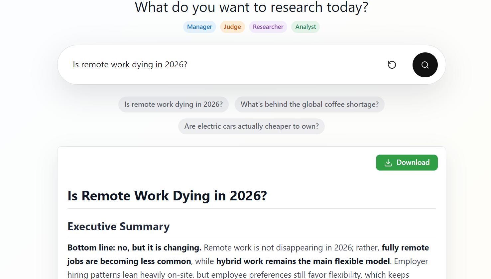
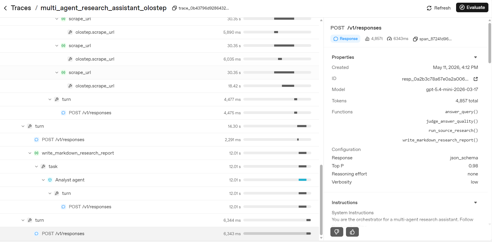

# Multi-Agent Research Assistant

A multi-agent research assistant built with the OpenAI Agents SDK, Olostep, and Reflex.



Enter a research question and a team of AI agents collaborates to produce a polished, source-backed Markdown research report. The original notebook is included, and the same logic is also available as a Reflex web app.

## Flow

```text
User question
    |
    v
Manager agent
    |
    +--> Olostep Answer API
    |        |
    |        v
    |    Judge agent
    |        |
    |        +--> Good enough --> Analyst agent --> Markdown report
    |        |
    |        +--> Needs more evidence
    |                 |
    |                 v
    |          Source research agent
    |                 |
    |                 +--> Search with Scrape
    |                 +--> Targeted Search
    |                 +--> Scrape selected URLs
    |                 |
    |                 v
    |          Analyst agent
    |                 |
    |                 v
    +----------> Markdown research report + sources
```



## Agents

| Agent | Role |
|---|---|
| **Manager** | Orchestrates the workflow: answer, judge, research if needed, then write. |
| **Judge** | Evaluates whether the initial answer is good enough or needs deeper research. |
| **Source Researcher** | Gathers evidence using Olostep search, scrape, and targeted web queries. Prioritizes the most recent sources. |
| **Analyst** | Writes the final Markdown research report from the gathered evidence. |

## Setup

Install dependencies:

```bash
pip install -r requirements.txt
```

Create a `.env` file from `.env.template`:

```bash
OPENAI_API_KEY=your_openai_api_key
OLOSTEP_API_KEY=your_olostep_api_key
OPENAI_MODEL=gpt-5.4-mini
```

## Run the Reflex app

```bash
reflex run
```

Then open the local URL printed by Reflex, usually:

```text
http://localhost:3000
```

The app files live in `app/`:

- `app/app.py` — Reflex UI with styled Markdown report rendering and download.
- `app/research_assistant.py` — OpenAI Agents SDK multi-agent workflow with Olostep tools.

## Features

- **Multi-agent workflow** — Manager, Judge, Source Researcher, and Analyst agents collaborate automatically.
- **Live progress logs** — Watch each agent step in real time.
- **Styled Markdown report** — Headings, bullets, tables, code blocks, and more render properly in the browser.
- **Download report** — Export the full Markdown report with one click.
- **Recent results** — The source research agent is aware of the current date and prioritizes up-to-date sources.


